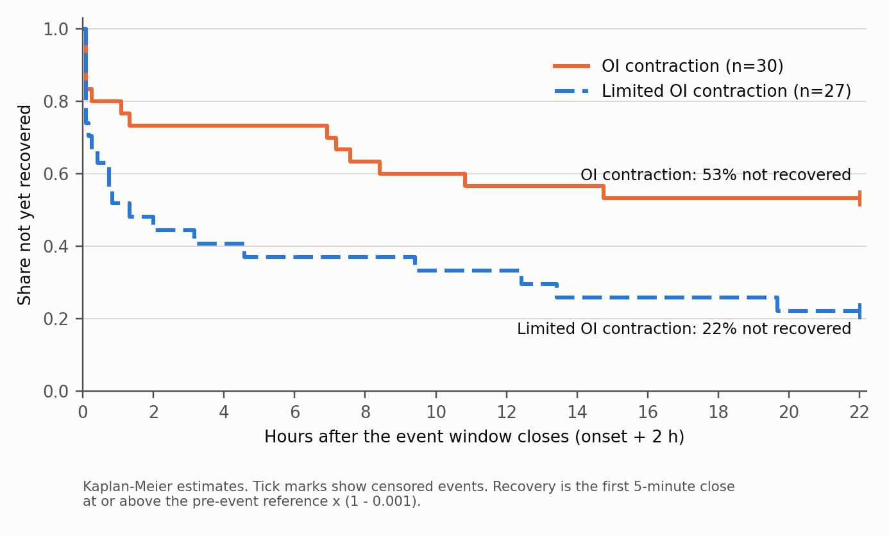
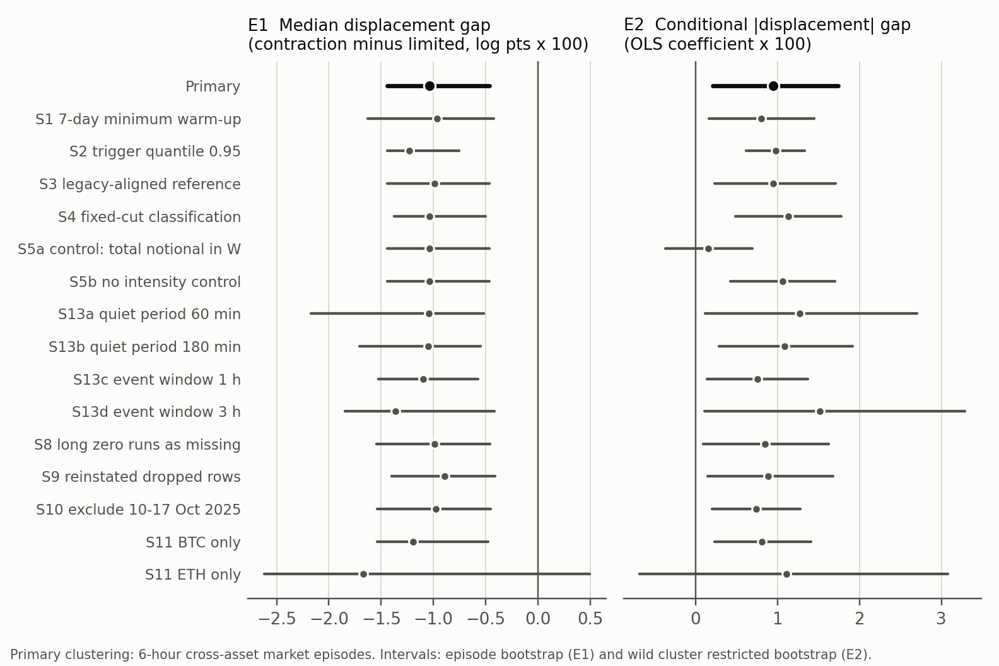

# Open Interest Contraction and Price Recovery Around Liquidation Events

Edwin Wan

A corrected exploratory reanalysis of BTC and ETH perpetual futures on Hyperliquid

Working paper version 3 | 11 September 2026, wording revised 12 September 2026 | Exploratory evidence, not prospectively validated

## Abstract

This paper asks whether liquidation-triggered stress onsets with a large contemporaneous fall in open interest (OI) differ in price behaviour from onsets where OI changes little. Version 3 re-estimates the study after correcting the event construction. Triggers now use completed five-minute bins and a threshold built only from earlier observations over a full 30-day baseline. Every measurement uses a fixed window anchored at the onset. OI is read with an explicit staleness limit. Recovery is measured from bar closes after the event window, censored at the follow-up actually observed. Uncertainty treats overlapping BTC and ETH events as shared market episodes. The corrected sample contains 134 onsets from 1 September to 31 December 2025: 30 in the contraction class and 27 in the limited-contraction class. Contraction-class onsets show deeper displacement over the event window (difference in medians −1.04 log points × 100; 95% episode-bootstrap interval −1.44 to −0.46), lower prices six hours later (−1.17; −2.02 to −0.30) and slower post-window recovery (53% versus 22% not recovered after 22 hours; restricted-mean difference 373 minutes, 87 to 674). The 24-hour difference is imprecise. The reversion-index difference is fragile across the declared sensitivity analyses. The apparent size-adjusted effect does not hold once a contemporaneous liquidation-volume control is added: with total liquidated notional in the window held fixed, the class coefficient is small and its interval includes zero. Contraction-class events carry about four times the liquidated notional of limited-contraction events, so this sample cannot separate the two. All results are descriptive associations from one venue, over a four-month event sample drawn from a five-month liquidation archive, and both groups are liquidation-triggered. The design identifies no causal or forced-versus-voluntary mechanism.

## 1 Introduction

Large liquidation episodes often coincide with falling prices and falling open interest. These co-movements admit several explanations. A price shock can cause liquidations, liquidation flow can add to the price decline, and new positions can offset closing positions in aggregate OI. The empirical task is to describe carefully what is observed before attaching a mechanism to it.

The question here is deliberately narrow. Among liquidation-triggered onsets, do those accompanied by relatively large OI contraction differ from those with little measured contraction in (a) price displacement over the event window, (b) the price level relative to the pre-event reference six and 24 hours later, and (c) how long price takes to recover once the event window has closed? The OI class is known only once the event window closes, two hours after onset, and it shares that window with the displacement measure. The comparison is therefore a contemporaneous descriptive association. It is not an ex-ante prediction. The six- and 24-hour price levels are observed after classification but remain measured against the pre-event reference, so they still contain the within-window movement used to classify the event; only the recovery clock starts after the classification window. Nothing here measures incremental predictive power, which would need a separate post-classification return and its own controls.

Version 2 of this paper corrected the terminology and described the legacy implementation accurately, but it did not change the analysis. Version 3 implements the empirical corrections. They fall into three groups, recorded in a protocol dated and hash-frozen on 11 September 2026 before any corrected outcome was computed: implementation bugs fixed, estimands deliberately redefined, and sensitivity choices declared in advance. The protocol is a post-hoc correction, not a preregistration. The legacy results were known when it was written.

The corrected evidence keeps the direction of the main legacy descriptive contrasts. Displacement, six-hour price change and recovery are robust to most declared alternatives. Three things do not survive. The reversion-index contrast is fragile. The 24-hour difference is imprecise. The suggestion that contraction-class events move more "at equal liquidation size" depends on how size is measured: with total liquidated volume in the same window held fixed, the coefficient is small and its interval includes zero.

## 2 Economic context and interpretation

Brunnermeier and Pedersen (2009) model the interaction between traders' funding constraints and market liquidity. Their liquidity-spiral mechanism motivates studying joint changes in positions and prices during stress, but a contemporaneous OI comparison does not identify that mechanism. Perez et al. (2021) study liquidations on the Compound lending protocol. Their work shows the value of protocol-level measurement, though the institutional setting differs from perpetual futures.

Hyperliquid's documentation describes liquidation as a response to insufficient maintenance margin, with order-book execution attempted first and a backstop process where applicable (Hyperliquid, Liquidations). This provides institutional context. It is not a historical verification of every rule that operated during the 2025 sample.

Aggregate OI is a stock of outstanding positions. Its change nets position opening against position closing and does not reveal the motive for any trade. Both classes in this paper begin with liquidation-triggered episodes. An episode with heavy liquidation and offsetting new positions can show little net contraction. Liquidated positions also reduce OI mechanically. The OI classes therefore describe a net position response. They do not split forced from voluntary flow.

## 3 Data, provenance and missing data

The analysis uses the supplied local extracts: liquidation fills from the Reservoir archive, Hyperliquid asset-context OI snapshots, and five-minute price bars built from one-minute asset-context price snapshots. All input files were verified against the SHA-256 hashes recorded by the version 2 verification before any computation.

Table 1 Stored input coverage

| Series | BTC rows | ETH rows | Coverage |
|---|---:|---:|---|
| Liquidation fills | 479,170 | 279,455 | 1 Aug to 31 Dec 2025 (153 of 153 dates) |
| Open interest snapshots | 264,909 | 264,909 | 1 Jul to 31 Dec 2025 |
| Derived five-minute price bars | 52,987 | 52,987 | 1 Jul to 31 Dec 2025 |

The provenance audit (Table 2) records what the local files can and cannot establish. The side mapping is internally consistent. Every sell-side row closes a long position (`Close Long`, or the less common `Liquidated Cross Long` and `Liquidated Isolated Long`). Every buy-side row closes a short. No sell row has a buy row with the same timestamp, price and size, so the partition does not contain both sides of the same fill. The trigger uses sell-side rows only.

Table 2 Provenance and missing-data audit

| Check | BTC | ETH |
|---|---:|---:|
| Record identifiers retained (trade, order, hash, user) | none | none |
| Rows removed by the legacy full-row deduplication (lower bound) | 31,253 (6.1%) | 24,500 (8.1%) |
| Five-minute bins with no liquidation rows | 88.4% | 89.9% |
| Zero-liquidation runs of 12 hours or longer | 14 | 22 |
| Longest zero-liquidation run (hours) | 24.8 | 25.2 |
| One-minute OI grid points missing / off-grid rows | 116 / 65 | 116 / 65 |
| Five-minute price bars missing | 5 | 5 |

Two findings matter for interpretation. First, the stored files keep no record identifiers. Second, the original acquisition script dropped rows that were identical on every retained field. The stored pandas index preserves pre-deduplication positions, and the raw order was already time-sorted, so the audit can count and date the removed rows. At least 6.1% of BTC rows and 8.1% of ETH rows were removed. Each was an exact copy, including the millisecond timestamp, of a retained row. Without identifiers from the raw archive it is impossible to tell whether they were genuine repeated rows or distinct fills that happened to match. Sensitivity analysis S9 reinstates them under an adjacent-row assumption. Timestamp duplication alone is never treated as duplication: BTC and ETH timestamps carry on average about 16 and 13 fills.

Most five-minute bins contain no liquidation, and zero runs reach 25 hours. The local files carry no within-day coverage metadata, and Hyperliquid's historical-data documentation warns that archived data may be missing (Hyperliquid, Historical data). The primary analysis treats empty bins inside covered days as zero, and this is stated as an assumption. Sensitivity analysis S8 instead treats zero runs of 12 hours or longer as missing. The price bars are derived from context-price snapshots. The ingestion code prefers `mid_px`, but the field actually used is not recorded in the stored files. Bar highs and lows are extremes of at most five one-minute snapshots, and volume is missing throughout. The series should not be read as executable trade prices.

## 4 Corrected event construction and outcomes

### Information-time conventions

Liquidation fills are grouped into five-minute bins that are closed on the left and labelled by their right edge E. A bin's contents are therefore available at E. The rolling liquidation measure R(E) is the sell-side notional with fill time in [E − 15 min, E). A price bar labelled L aggregates snapshots in [L, L + 5 min), and its close is treated as available at L + 5 min. OI is read as of a time g: the most recent snapshot at or before g, used only if it is no more than two minutes old.

### Triggers and onsets

A trigger occurs at E when R(E) is positive and at least the 99th percentile of R over the prior decision times [E − 30 days, E). The current value never enters its own threshold. A full 30-day baseline is required, so the first eligible decision time is 31 August 2025. An onset E0 is a trigger that comes more than 120 minutes after the previous trigger. This is the legacy chaining rule, but every measurement is now anchored at E0 in fixed windows, and later triggers change nothing.

The legacy implementation differed in three ways, each corrected here. It labelled bins by their left edge, so a trigger stamped t0 used fills up to t0 + 5 min. It included the current value in its own quantile. It accepted a threshold computed from only seven days. Legacy intensity was also the maximum rolling notional over a chain of triggers that could run for up to 455 minutes (18 of 162 legacy events spanned more than two hours).

### Windows, OI classes and outcomes

The reference price is the mean close of the six bars ending 40 to 15 minutes before onset. It therefore ends before the first fill that can enter the triggering 15-minute window. The legacy reference overlapped that window. The event window is W = [E0 − 15 min, E0 + 120 min). Displacement is the log ratio of the lowest bar low in W to the reference. The OI response compares the minimum as-of OI over W with the mean as-of OI over the preceding hour. Both are known at A = E0 + 120 min, the classification time.

The classification rule is unchanged from legacy. Contraction means an OI response at or below the tenth percentile of the same asset's earlier event responses, with a fixed −2.5% cut until 20 earlier responses exist. Limited contraction means a response above −0.5%. Everything else is intermediate. The six- and 24-hour price changes use the as-of bar close at E0 + h, accepted only if no more than ten minutes old. Both are measured against the same pre-event reference, so they include the within-window decline as well as anything that happens afterwards. The reversion index is one minus the ratio of the six-hour change to displacement, clipped to [0, 1]. It is a bounded descriptive index, not a decomposition into temporary and permanent impact.

Post-window recovery is the time from A until the first five-minute close at or above the reference × (1 − 0.001). Follow-up ends at E0 + 24 hours, at the end of the data, or at a price gap longer than 15 minutes, and events are censored where it ends. This measure differs from the legacy statistic, which looked for an intrabar high after the trough bar and could credit a crossing in the same bar as the trough, although a bar's high may precede its low. The legacy code also assigned 24 hours of follow-up whether or not it was observed. In the legacy sample that vulnerability affected one intermediate-class event only, and it did not inflate the headline groups' censoring rates. No corrected event has incomplete recovery follow-up. One intermediate-class event (BTC, 31 December 2025) lacks a 24-hour price and is excluded from that horizon only.

### Uncertainty

Of the 69 corrected BTC onsets, 33 have an ETH onset within 30 minutes, and outcome windows overlap. The primary independent units are therefore cross-asset market episodes: single-linkage groups of events whose outcome intervals overlap. The horizon matches the outcome: six hours for displacement, six-hour change, the reversion index and the regression; 24 hours for the 24-hour change and recovery. Differences in medians and in restricted mean recovery time come with episode-bootstrap percentile intervals (4,999 draws). The regression uses CR1 cluster-robust standard errors with G − 1 degrees of freedom and a wild cluster restricted bootstrap with Webb weights (9,999 draws), with confidence intervals obtained by test inversion (Cameron, Gelbach and Miller 2008; MacKinnon and Webb 2017; Roodman et al. 2019; Webb 2023). For recovery the paper reports Kaplan–Meier curves (Kaplan and Meier 1958), restricted mean survival time (Royston and Parmar 2013) and a log-rank score test with a sandwich variance summed within episodes (Lin and Wei 1989).

Three assumptions matter. Episodes are treated as independent, which ignores slower volatility-regime dependence; calendar-week clustering is a declared sensitivity. The number of units is small: 43 six-hour episodes contain contrast events, only four of them contain both classes, and the effective cluster count for the regression is 21.6 (Carter, Schnepel and Steigerwald 2017). Cluster-robust procedures can mislead with few or unbalanced clusters (Cameron and Miller 2015; MacKinnon and Webb 2017). Finally, the classes are not randomly assigned. The intervals describe sampling uncertainty for a descriptive contrast, and no randomisation test is claimed. Clustering here reflects shared shocks rather than a sampling design, a distinction discussed by Abadie et al. (2023), and cross-sectional correlation on shared event dates is a known problem for event-study inference (Kolari and Pynnönen 2010).

## 5 Results

### Event membership

Table 3 shows how each correction changes the event count at the 99th-percentile trigger. Right-labelling the bins shifts timestamps but changes no count. Excluding the current value from its own threshold adds one BTC onset (15 October 2025, limited contraction). The full 30-day baseline removes all 29 onsets dated 10 to 29 August, among them 16 of the 38 legacy contraction events. No onset fails the reference, window-coverage or OI-coverage requirements. Of the 133 legacy onsets that remain, every one falls in exactly the same trigger bin.

Table 3 Event-count waterfall

| Stage | BTC | ETH | Total |
|---|---:|---:|---:|
| Legacy construction | 80 | 82 | 162 |
| Right-labelled completed bins | 80 | 82 | 162 |
| Threshold from prior decision times only | 81 | 82 | 163 |
| Full 30-day baseline (primary trigger rule) | 69 | 65 | 134 |
| Measurement requirements met | 69 | 65 | 134 |

Classes change mainly because the expanding contraction cut is recomputed from a different set of earlier events. Of the 133 retained legacy onsets, 21 of 22 legacy contraction events remain contraction and 24 of 27 legacy limited events remain limited. Nine legacy intermediate events become contraction and two become limited. The corrected contrast has 30 contraction and 27 limited-contraction onsets.

### Descriptive results

Table 4 Corrected class summaries

| Measure | Contraction | Limited | Intermediate |
|---|---:|---:|---:|
| Events (BTC / ETH) | 30 (17 / 13) | 27 (15 / 12) | 77 (37 / 40) |
| Median OI response (%) | −6.43 | +0.29 | −1.95 |
| Median displacement (log pts × 100) | −2.28 | −1.25 | −1.96 |
| Median six-hour change (log pts × 100) | −1.62 | −0.45 | −0.82 |
| Median 24-hour change (log pts × 100) | −1.68 | −0.59 | −1.06 |
| Median reversion index | 0.25 | 0.73 | 0.45 |
| Not recovered 22 h after the window (KM, %) | 53 | 22 | 35 |
| Restricted mean time to recovery (min, of 1,320) | 822 | 448 | 580 |
| Median sell notional in window (m USD) | 62.7 | 15.8 | 21.2 |
| Median onset intensity R(E0) (m USD) | 11.2 | 9.3 | 11.8 |

The legacy medians on the 133 retained onsets are close to their full-sample values: −2.12 and −1.25 for displacement, 0.32 and 0.84 for the reversion index. The corrected differences are therefore not an artefact of losing the August events. Figure 1 shows the post-window recovery curves.

### Primary effects

Table 5 reports the six pre-specified effect measures, with the reading given by the protocol's frozen rules. "Supported" means only that the corrected estimate has the legacy sign and a primary 95% interval that excludes zero. It does not confirm a hypothesis.

Table 5 Primary effects, contraction minus limited contraction

| Effect | Estimate | 95% interval | Reading |
|---|---:|---:|---|
| E1 Displacement, median difference (log pts × 100) | −1.04 | −1.44 to −0.46 | Supported (exploratory) |
| E2 \|Displacement\| on class, onset intensity and asset (coefficient × 100) | 0.95 | 0.21 to 1.74 | Supported (exploratory) |
| E3 Six-hour change, median difference (log pts × 100) | −1.17 | −2.02 to −0.30 | Supported (exploratory) |
| E4 24-hour change, median difference (log pts × 100) | −1.09 | −2.32 to 0.59 | Consistent, imprecise |
| E5 Reversion index, median difference | −0.47 | −0.78 to −0.02 | Supported (exploratory) |
| E6 Restricted mean recovery time difference (minutes) | 373 | 87 to 674 | Supported (exploratory) |

For E2, the wild cluster bootstrap p value is 0.010 and the CR1 interval is 0.19 to 1.71 with 42 degrees of freedom. For E6, the cluster-robust log-rank p value is 0.017. Using the same inference, the legacy 162-event table gives a regression coefficient of 0.51 with interval −0.15 to 1.18 (p = 0.12) and a reversion-index difference of −0.46 with interval −0.75 to 0.15. The legacy p values of 0.0108, 0.0367, 0.0166 and 0.0533 are therefore not supported as stated. The value of 0.0001 belonged only to the 95th-percentile extension.

### Size and what the OI class measures

The conditional association in E2 depends on the size control. Using onset intensity R(E0), the only size measure available at the trigger, the coefficient is 0.95. Using total sell-side liquidation notional over the event window, as in sensitivity S5a, it falls to 0.15, with interval −0.37 to 0.70 (p = 0.55). Table 4 explains why. Onset intensity is similar across classes, but contraction-class events accumulate about four times as much liquidated notional over the window. The rank correlation between OI destroyed and log window notional is 0.42. A post-hoc diagnostic, added after this result was seen and not used to choose any specification, regresses displacement on continuous OI destroyed with the window-notional control. It gives 0.05 log points × 100 per percentage point of OI destroyed, with interval −0.03 to 0.12. The data therefore support "larger OI contraction coincides with deeper, more persistent declines". Once window volume is held fixed there is no clear additional association in this specification. That is not evidence that the OI response has no role of its own, nor proof that liquidation volume accounts for the whole relationship: in this sample the two move together closely enough that they cannot be separated.

### Sensitivity analyses

Figure 2 and Table 6 summarise the declared sensitivity analyses; the complete grid is in `reanalysis/outputs/TABLES.md`. The analyses that change the event set or measures are S1 to S4, S8 to S11 and S13. Across those thirteen:

- **Displacement (E1) and six-hour change (E3):** the legacy sign with an interval excluding zero in 12 of 13. The exception is ETH alone, where no episode contains both classes.
- **Recovery (E6):** holds in 11 of 13. The legacy-aligned reference (S3) gives 291 minutes, with interval −24 to 639, and ETH alone is imprecise.
- **Reversion index (E5):** holds in only 6 of 13.
- **24-hour change (E4):** excludes zero only at the 95th-percentile trigger.
- **E2:** keeps its sign everywhere, but its interval includes zero under the window-notional control and for ETH alone.
- **Clustering (S7):** alternative clusterings (24-hour episodes, UTC day, ISO week with only 16 clusters) leave these conclusions unchanged.

Table 6 Selected sensitivity results (estimate and 95% interval)

| Specification | n (c / l) | E1 displacement | E2 coefficient | E6 recovery (min) |
|---|---:|---:|---:|---:|
| Primary | 30 / 27 | −1.04 (−1.44, −0.46) | 0.95 (0.21, 1.74) | 373 (87, 674) |
| S1 seven-day warm-up | 38 / 28 | −0.96 (−1.63, −0.42) | 0.80 (0.16, 1.45) | 348 (92, 655) |
| S2 trigger quantile 0.95 | 59 / 105 | −1.23 (−1.44, −0.75) | 0.98 (0.61, 1.33) | 359 (204, 523) |
| S3 legacy-aligned reference | 30 / 27 | −0.99 (−1.44, −0.47) | 0.95 (0.23, 1.71) | 291 (−24, 639) |
| S5a window-notional control | 30 / 27 | as primary | 0.15 (−0.37, 0.70) | as primary |
| S9 reinstated dropped rows | 29 / 25 | −0.89 (−1.40, −0.41) | 0.89 (0.15, 1.68) | 381 (85, 690) |
| S10 excluding 10–17 Oct 2025 | 24 / 24 | −0.98 (−1.54, −0.45) | 0.74 (0.20, 1.28) | 399 (90, 728) |
| S11 ETH only | 13 / 12 | −1.67 (−2.62, 0.49) | 1.11 (−0.68, 3.08) | 282 (−176, 846) |

## 6 What survives

Table 7 Legacy claims and their corrected status

| Legacy statement | Status after correction |
|---|---|
| Contraction-class events have deeper price minima | Survives as an exploratory, contemporaneous association (12 of 13 sensitivity analyses) |
| Lower price level six hours later | Survives (12 of 13) |
| Less six-hour reversion (bounded index) | Fragile: primary interval barely excludes zero; 6 of 13 sensitivity analyses |
| Slower recovery, more unrecovered events | Survives under a new, unambiguous post-window estimand (11 of 13) |
| Larger displacement at equal liquidation size | Not established: with window liquidation volume held fixed, the coefficient is small and its interval includes zero |
| 24-hour difference | Same sign, imprecise |
| Forced versus voluntary price impact | Not identified by this design |
| Original hypotheses (more reversion, faster recovery for contraction) | Contradicted descriptively; disclosure retained |

## 7 Limitations and validation requirements

The sample covers one venue, two assets and four months of eligible onsets, drawn from a five-month liquidation archive. The 57 contrast events fall into 43 six-hour episodes, only four of which contain both classes. Those episodes are treated as independent units; independence across episodes is an assumption of the inference, not a property demonstrated here. Most comparisons are therefore between different market episodes, and episode-level conditions such as volatility regime, time of day and market-wide moves are not held fixed.

The liquidation archive cannot be reconciled locally. Identifiers are absent, an unverifiable share of rows was removed during acquisition, and empty bins cannot be told apart from gaps. S8 and S9 probe sensitivity to two selected assumptions about those problems. They do not bound the possible error from missing fills or from removed rows, and reinstating adjacent rows does not recover verified raw records. The price series is derived from sampled context prices. Its extremes can miss true intrabar extremes, and that error need not be the same across classes.

The protocol freezes definitions only after the legacy results were known. Choices with visible consequences (the 30-day warm-up, the reference window and the recovery estimand) were fixed on methodological grounds before corrected outcomes were computed, and the alternatives were all reported. That is weaker than preregistration.

The OI class mixes liquidation volume with offsetting new positions, and the size result shows the two cannot be separated with net OI alone. A natural next step is to decompose the OI change into liquidated contracts and other net position flow. That needs liquidation sizes that reconcile with the archive, which requires identifiers.

A prospective test would fix these definitions, apply them to a validation window that has not informed any choice made here, and state in advance which outcome, horizon and effect size would count as replication. Data dated after 31 December 2025 are not automatically out of sample: once they have been looked at, they are not untouched. It would also ask whether OI contraction observed by the end of the window predicts later persistence beyond prices, volatility and liquidation volume already observed. None of that can be inferred from this sample.

## 8 Conclusion

After correcting event timing, threshold construction, window bounds, OI staleness, recovery measurement and dependence-aware inference, the main descriptive contrast in the Hyperliquid sample remains. Liquidation-triggered onsets with larger contemporaneous OI contraction show deeper displacement, lower prices six hours later and slower recovery than onsets with limited contraction. The reversion-index difference is fragile, the 24-hour difference is imprecise, and the size-adjusted interpretation does not hold once total liquidation volume in the same window is controlled, where the class coefficient is small with an interval including zero. The evidence is an exploratory description of how price and position responses co-move in liquidation stress. It does not establish a forced-versus-voluntary price-impact effect, market inefficiency, or a trading rule.

## References

Abadie, A., Athey, S., Imbens, G. W., and Wooldridge, J. M. (2023). When Should You Adjust Standard Errors for Clustering? The Quarterly Journal of Economics, 138(1), 1-35.

Brunnermeier, M. K., and Pedersen, L. H. (2009). Market Liquidity and Funding Liquidity. The Review of Financial Studies, 22(6), 2201-2238.

Cameron, A. C., Gelbach, J. B., and Miller, D. L. (2008). Bootstrap-Based Improvements for Inference with Clustered Errors. The Review of Economics and Statistics, 90(3), 414-427.

Cameron, A. C., and Miller, D. L. (2015). A Practitioner's Guide to Cluster-Robust Inference. Journal of Human Resources, 50(2), 317-372.

Carter, A. V., Schnepel, K. T., and Steigerwald, D. G. (2017). Asymptotic Behavior of a t-Test Robust to Cluster Heterogeneity. The Review of Economics and Statistics, 99(4), 698-709.

Hyperliquid (accessed 10 September 2026). Historical data. Documentation. https://hyperliquid.gitbook.io/hyperliquid-docs/historical-data

Hyperliquid (accessed 10 September 2026). Liquidations. Documentation. https://hyperliquid.gitbook.io/hyperliquid-docs/trading/liquidations

Kaplan, E. L., and Meier, P. (1958). Nonparametric Estimation from Incomplete Observations. Journal of the American Statistical Association, 53(282), 457-481.

Kolari, J. W., and Pynnönen, S. (2010). Event Study Testing with Cross-sectional Correlation of Abnormal Returns. The Review of Financial Studies, 23(11), 3996-4025.

Lin, D. Y., and Wei, L. J. (1989). The Robust Inference for the Cox Proportional Hazards Model. Journal of the American Statistical Association, 84(408), 1074-1078.

MacKinnon, J. G., and Webb, M. D. (2017). Wild Bootstrap Inference for Wildly Different Cluster Sizes. Journal of Applied Econometrics, 32(2), 233-254.

Perez, D., Werner, S. M., Xu, J., and Livshits, B. (2021). Liquidations: DeFi on a Knife-edge. Financial Cryptography and Data Security, 457-476. https://arxiv.org/abs/2009.13235

Roodman, D., Nielsen, M. Ø., MacKinnon, J. G., and Webb, M. D. (2019). Fast and Wild: Bootstrap Inference in Stata Using boottest. The Stata Journal, 19(1), 4-60.

Royston, P., and Parmar, M. K. B. (2013). Restricted Mean Survival Time: An Alternative to the Hazard Ratio for the Design and Analysis of Randomized Trials with a Time-to-Event Outcome. BMC Medical Research Methodology, 13, 152.

Webb, M. D. (2023). Reworking Wild Bootstrap-Based Inference for Clustered Errors. Canadian Journal of Economics, 56(3), 839-858.

## Appendix Reproducibility and version history

An independent reviewer reproduced the v3 results on 11 September 2026 with a different Parquet engine, confirming the tests, the 134 events and every primary estimate, and asked for wording corrections. Those were applied on 12 September 2026 and changed no number; they are listed in `reanalysis/protocol/DEVIATIONS.md`.

Version 3 replaces the legacy event construction, outcome measurement and inference with the definitions in `reanalysis/protocol/CORRECTION_PROTOCOL.md` (SHA-256 37fb3f285fbaaa79a20c8bac2ca93e0ba3f08a6df01154cd7492d05ae08377c8, frozen 11 September 2026). Clarifications and labelled post-hoc additions are listed in `reanalysis/protocol/DEVIATIONS.md`. The legacy construction is reproduced exactly from the supplied data before any corrected definition is applied. That covers 162 and 425 events, all stored columns, the group medians and censoring shares, and both regression coefficients.

The corrected code, 26 synthetic and integration tests, the provenance audit, every sensitivity analysis, and an input and output manifest with SHA-256 hashes are in `reanalysis/`. The tests cover completed-bin timing, threshold exclusion, trigger invariance to future-data truncation, bounded windows under chained triggers, OI staleness, missing bars, intrabar crossing ambiguity, insufficient follow-up and shared BTC/ETH episodes. The full pipeline was run in two environments with different Python, numpy and pandas versions and gave identical results. Version 2 and the original paper, scripts and data are unchanged.
